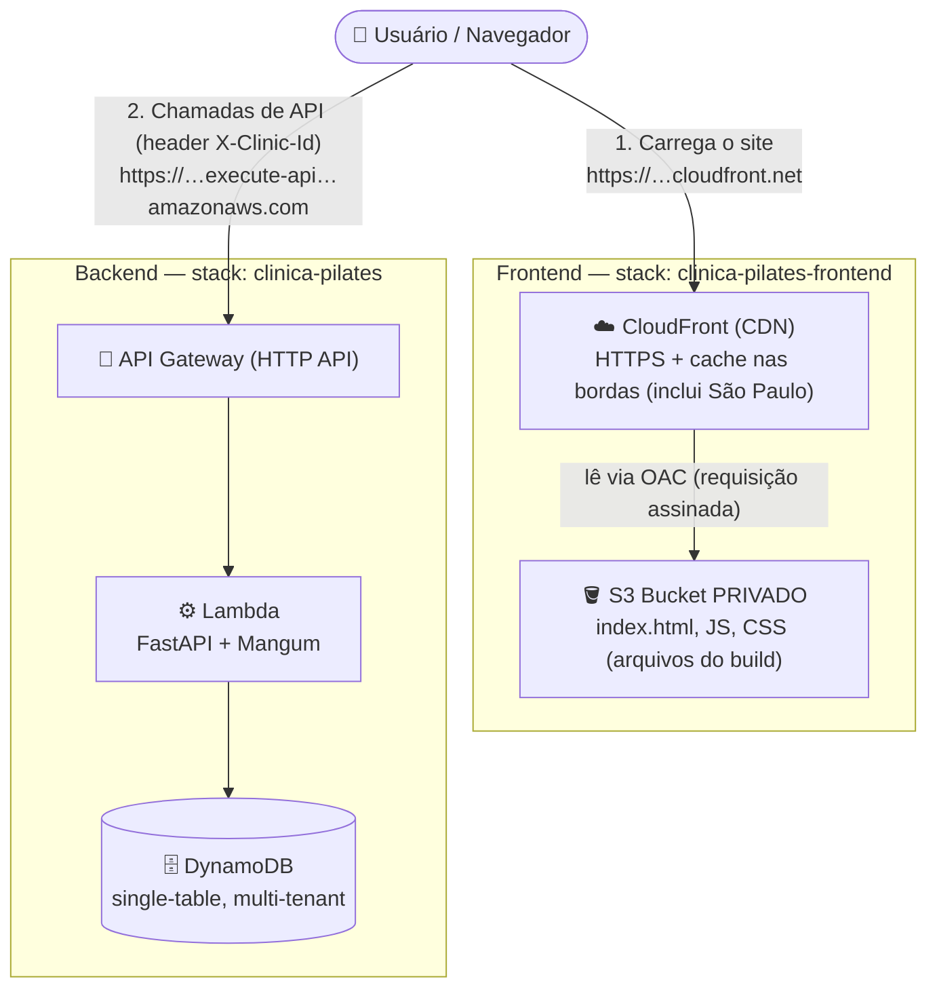
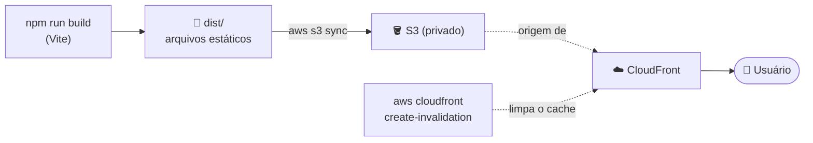

# Arquitetura & Deploy

Visão geral de como o sistema está hospedado na AWS. São **dois stacks
independentes** (CloudFormation): o do backend (API) e o do frontend (hosting).

---

## Visão geral (frontend + backend)



**Como ler:** o navegador faz **duas coisas separadas**:
1. **Baixa o site** (HTML/JS/CSS) do **CloudFront** (que puxa do S3 privado).
2. Uma vez carregado, o JavaScript do site **chama a API** (API Gateway → Lambda → DynamoDB) para ler/gravar pacientes e aparelhos.

---

## Frontend: por que S3 **privado** + CloudFront (e não "site estático" do S3)

O S3 **apenas armazena** os arquivos — ele **não** serve o site diretamente ao
público. Quem entrega ao usuário é o CloudFront.

| | S3 "Static Website Hosting" | **O que usamos: S3 privado + CloudFront** |
| --- | --- | --- |
| Bucket | Público | **Privado** (acesso público bloqueado) |
| Protocolo | Só HTTP | **HTTPS** ✅ |
| Quem lê o bucket | Qualquer um | **Só o CloudFront** (via OAC) |
| CDN / cache global | Não | Sim (borda de São Paulo) |

**Peças:**
- **S3 (bucket privado)** — o "armário" dos arquivos. `PublicAccessBlock` ligado; ninguém acessa direto.
- **OAC (Origin Access Control)** — a credencial que autoriza **somente o CloudFront** a ler o bucket.
- **CloudFront (CDN)** — dá o HTTPS (via `*.cloudfront.net`), cacheia nas bordas e é o único que lê o S3. Fallback SPA: 403/404 → `index.html`.

---

## Pipeline de publicação do frontend



Comandos (também no `STATE.md`):
```bash
cd frontend
npm run build
aws s3 sync dist s3://clinica-pilates-frontend-sitebucket-n6oomystbesc --delete
aws cloudfront create-invalidation --distribution-id EGYNGZONKGVLT --paths "/*"
```
> Publicar o site **não** precisa de Docker nem SAM (só o backend precisa).

---

## Recursos (us-east-1)

| Recurso | Identificador | Stack |
| --- | --- | --- |
| Site (URL) | https://d1th2j57vyxahs.cloudfront.net | clinica-pilates-frontend |
| Bucket S3 (privado) | `clinica-pilates-frontend-sitebucket-n6oomystbesc` | clinica-pilates-frontend |
| CloudFront Distribution | `EGYNGZONKGVLT` | clinica-pilates-frontend |
| API (URL) | https://8f1ffym997.execute-api.us-east-1.amazonaws.com | clinica-pilates |
| Lambda | `clinica-pilates-ClinicaApiFunction-3huxBJXkP1qi` | clinica-pilates |
| DynamoDB | `clinica-pilates-ClinicaTable-8YQAEIFAKZGE` | clinica-pilates |

---

## Segurança / multi-tenant (resumo)

- **CORS** é tratado pelo próprio FastAPI (`CORSMiddleware`), não no API Gateway.
- **Multi-tenant:** cada registro carrega o `clinicId` na chave (`PK=CLINIC#<clinicId>#…`). Hoje o `clinicId` vem do header `X-Clinic-Id` (login simples do demo); no M3 (Cognito) virá do token — mudando só `get_clinic_id` (`src/app/deps.py`).
- ⚠️ O link do demo é **aberto** (sem autenticação ainda). Autenticação real = M3.

> 💡 Diagramas gerados como Mermaid inline. Para renderizar/editar com mais recursos
> (SVG/PNG, temas), considere instalar o skill `mermaid-studio`.
