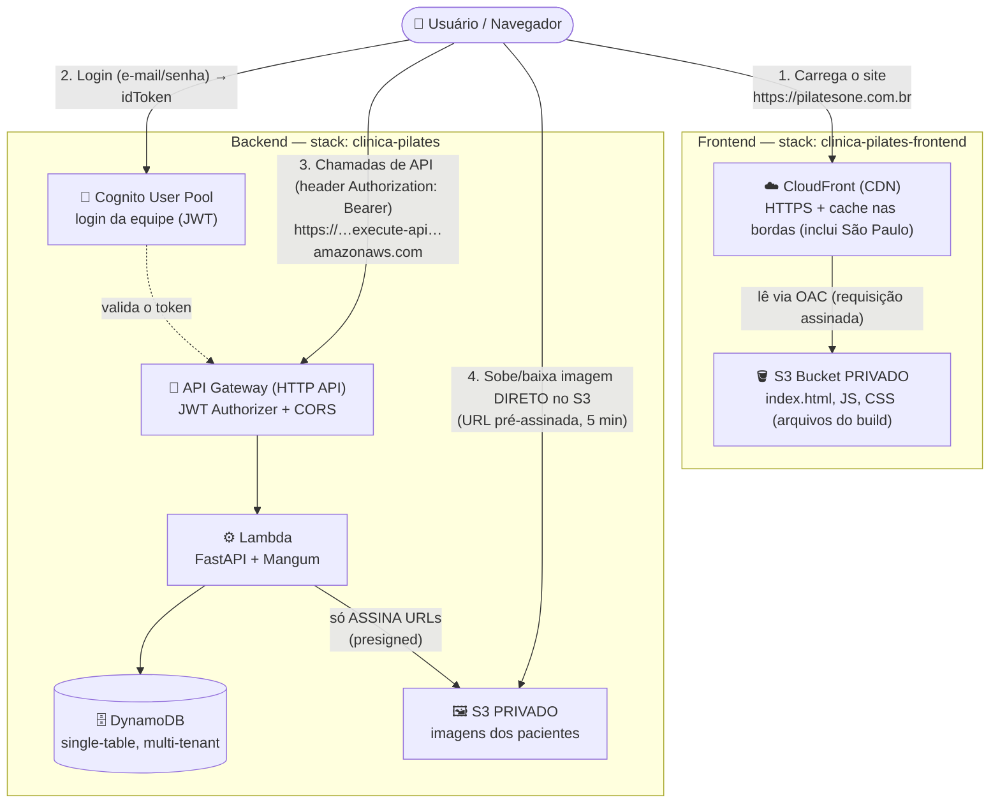
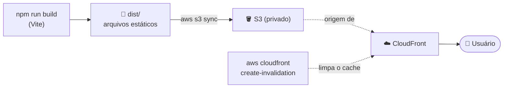

# Arquitetura & Deploy

Visão geral de como o sistema está hospedado na AWS. São **dois stacks
independentes** (CloudFormation): o do backend (API) e o do frontend (hosting).

---

## Visão geral (frontend + backend)


```mermaid
flowchart TB
    user(["👤 Usuário / Navegador"])

    subgraph front["Frontend — stack: clinica-pilates-frontend"]
        direction TB
        cf["☁️ CloudFront (CDN)<br/>HTTPS + cache nas bordas (inclui São Paulo)"]
        s3["🪣 S3 Bucket PRIVADO<br/>index.html, JS, CSS (arquivos do build)"]
        cf -- "lê via OAC (requisição assinada)" --> s3
    end

    subgraph back["Backend — stack: clinica-pilates"]
        direction TB
        cog["🔐 Cognito User Pool<br/>login da equipe (JWT)"]
        apigw["🚪 API Gateway (HTTP API)<br/>JWT Authorizer + CORS"]
        lambda["⚙️ Lambda<br/>FastAPI + Mangum"]
        ddb[("🗄️ DynamoDB<br/>single-table, multi-tenant")]
        imgs["🖼️ S3 PRIVADO<br/>imagens dos pacientes"]
        cog -. "valida o token" .-> apigw
        apigw --> lambda --> ddb
        lambda -- "só ASSINA URLs<br/>(presigned)" --> imgs
    end

    user -- "1. Carrega o site<br/>https://pilatesone.com.br" --> cf
    user -- "2. Login (e-mail/senha) → idToken" --> cog
    user -- "3. Chamadas de API (header Authorization: Bearer)<br/>https://…execute-api…amazonaws.com" --> apigw
    user -- "4. Sobe/baixa imagem DIRETO no S3<br/>(URL pré-assinada, 5 min)" --> imgs
```

**Como ler:** o navegador faz **quatro coisas separadas**:
1. **Baixa o site** (HTML/JS/CSS) do **CloudFront** (que puxa do S3 privado).
2. **Faz login** no Cognito e recebe um `idToken` (que carrega `custom:clinicId` e `custom:role`).
3. O JavaScript **chama a API** com `Authorization: Bearer <idToken>` (API Gateway valida o token na borda → Lambda → DynamoDB).
4. Para **imagens**, o navegador sobe e baixa **direto do S3** por URL pré-assinada — o binário **nunca passa** pela Lambda nem pelo API Gateway (barato e rápido). A Lambda só assina a URL.

---

## Frontend: por que S3 **privado** + CloudFront (e não "site estático" do S3)

O S3 **apenas armazena** os arquivos — ele **não** serve o site diretamente ao
público. Quem entrega ao usuário é o CloudFront.

| | S3 "Static Website Hosting" | **O que usamos: S3 privado + CloudFront** |
| --- | --- | --- |
| Bucket | Público | **Privado** (acesso público bloqueado) |
| Protocolo | Só HTTP | **HTTPS** ✅ |
| Quem lê o bucket | Qualquer um | **Só o CloudFront** (via OAC) |
| CDN / cache global | Não | Sim (borda de São Paulo) |

**Peças:**
- **S3 (bucket privado)** — o "armário" dos arquivos. `PublicAccessBlock` ligado; ninguém acessa direto.
- **OAC (Origin Access Control)** — a credencial que autoriza **somente o CloudFront** a ler o bucket.
- **CloudFront (CDN)** — dá o HTTPS (via `*.cloudfront.net`), cacheia nas bordas e é o único que lê o S3. Fallback SPA: 403/404 → `index.html`.

---

## Pipeline de publicação do frontend


```mermaid
flowchart LR
    build["npm run build<br/>(Vite)"] --> dist["📁 dist/<br/>arquivos estáticos"]
    dist -- "aws s3 sync" --> s3["🪣 S3 (privado)"]
    s3 -. "origem de" .-> cf["☁️ CloudFront"]
    inval["aws cloudfront<br/>create-invalidation"] -. "limpa o cache" .-> cf
    cf --> user(["👤 Usuário"])
```

Comandos (também no `STATE.md`):
```bash
cd frontend
npm run build
aws s3 sync dist s3://clinica-pilates-frontend-sitebucket-n6oomystbesc --delete
aws cloudfront create-invalidation --distribution-id EGYNGZONKGVLT --paths "/*"
```
> Publicar o site **não** precisa de Docker nem SAM (só o backend precisa).

---

## Pipeline de publicação do backend

O caminho oficial é `sam build --use-container` (AD-006): o container Linux gera as
wheels `manylinux` corretas do `pydantic-core` (as wheels do Windows **não rodam** no
Lambda) e dispensa ter python3.13 local.

```bash
sam build --use-container   # precisa do Docker Desktop rodando
sam deploy                  # confirm_changeset=true → revisa antes de aplicar
```

### Atalho sem Docker (quando as dependências não mudam)

A máquina de dev tem 7,7 GB de RAM e **não consegue subir a VM WSL2 do Docker** com o
VS Code aberto. Enquanto `src/requirements.txt` estiver **inalterado**, as libs não
precisam ser reconstruídas — dá para reaproveitar as wheels Linux de um build anterior:

```bash
cp -r .aws-sam/build .aws-sam/build.bak-<algo>                      # backup
rm -rf .aws-sam/build/ClinicaApiFunction/app
cp -r src/app .aws-sam/build/ClinicaApiFunction/app                 # só o código muda
sed 's|CodeUri: src/|CodeUri: ClinicaApiFunction|' template.yaml > .aws-sam/build/template.yaml
sam validate --lint -t .aws-sam/build/template.yaml
sam deploy --no-execute-changeset                                   # revisa o changeset
aws cloudformation execute-change-set --change-set-name <arn>
```

> ⚠️ Só vale com `src/requirements.txt` inalterado. Entrando dependência nova (ainda
> mais com código nativo), use o container — ou baixe as wheels Linux sem Docker com
> `pip install --platform manylinux2014_x86_64 --only-binary=:all: --python-version 3.13 --target <dir>`.
>
> Notas do ambiente: `sam` só está no PATH do **PowerShell**, não do Bash. E o
> `confirm_changeset = true` do `samconfig.toml` **trava** em sessão não-interativa —
> daí o par `--no-execute-changeset` + `execute-change-set`.

---

## Recursos (us-east-1)

| Recurso | Identificador | Stack |
| --- | --- | --- |
| Site (domínio) | https://pilatesone.com.br | clinica-pilates-frontend |
| Site (URL CloudFront) | https://d1th2j57vyxahs.cloudfront.net | clinica-pilates-frontend |
| Bucket S3 do site (privado) | `clinica-pilates-frontend-sitebucket-n6oomystbesc` | clinica-pilates-frontend |
| CloudFront Distribution | `EGYNGZONKGVLT` | clinica-pilates-frontend |
| API (URL) | https://8f1ffym997.execute-api.us-east-1.amazonaws.com | clinica-pilates |
| Lambda | `clinica-pilates-ClinicaApiFunction-3huxBJXkP1qi` | clinica-pilates |
| DynamoDB | `clinica-pilates-ClinicaTable-8YQAEIFAKZGE` | clinica-pilates |
| **Bucket S3 das imagens (privado)** | `clinica-pilates-patientimagesbucket-ff6veht0bouu` | clinica-pilates |
| Cognito User Pool | `us-east-1_tusTZNRL6` | clinica-pilates |
| Cognito App Client (SPA) | `6cke2rskmcq3ogim7c7ns4qqbn` | clinica-pilates |

---

## Segurança / multi-tenant (resumo)

- **Autenticação (M3, no ar):** login real via **Cognito User Pool**. Sem auto-cadastro público (`AllowAdminCreateUserOnly`) — contas nascem via `AdminCreateUser` (script de onboarding ou endpoint `/membros`). O **JWT Authorizer** do API Gateway valida assinatura/expiração **na borda**: sem token válido, a requisição nem chega na Lambda (`401`). Só `GET /health` é público.
- **CORS** é do **API Gateway** (`CorsConfiguration`), **não** mais do FastAPI — o `CORSMiddleware` foi removido do app no M3 (senão os headers `Access-Control-*` duplicariam). Motivo: com o authorizer default, o preflight `OPTIONS` chega **sem** `Authorization` e seria barrado com `401`; deixando o `OPTIONS` sem rota, o API Gateway responde o preflight sozinho. Por isso as rotas são por **método explícito** (GET/POST/PUT/DELETE), nunca `ANY`.
- **Multi-tenant:** cada registro carrega o `clinicId` na chave (`PK=CLINIC#<clinicId>#…`). O `clinicId` vem da claim **`custom:clinicId` do token** (`get_clinic_id`, em `src/app/deps.py`) — nunca do corpo da requisição. O usuário **não consegue escrever** esse atributo (fora de `WriteAttributes` do App Client, AD-012).
- **Imagens:** bucket **privado** (`BlockPublicAccess` nos 4 flags, SSE-S3). O acesso é só por **URL pré-assinada de 5 min** gerada pela Lambda; a chave é `<clinicId>/<pacienteId>/<id>.<ext>`, montada a partir do token — clínica A não alcança imagem de B. IAM da Lambda restrito a `Put/Get/DeleteObject` **nesse** bucket.
- **Duas camadas:** autenticação ("quem é você" = Cognito) + autorização/isolamento ("só a sua clínica" = filtro por `clinicId`).

> 💡 Diagramas gerados como Mermaid inline. Para renderizar/editar com mais recursos
> (SVG/PNG, temas), considere instalar o skill `mermaid-studio`.
